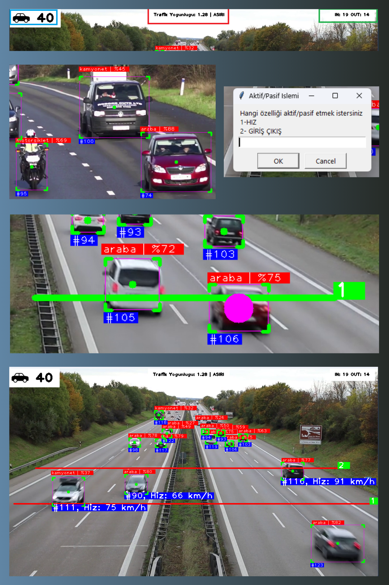

# YOLOv8 Trafik Yönetimi Projesi

Bu proje, YOLOv8 (You Only Look Once) nesne algılama modelini kullanarak trafikteki araçları sınıflandırma, takip etme, sayma ve hız tahmini yapmayı hedeflemektedir. YOLOv8 modeli, gerçek zamanlı nesne algılama yetenekleri ve yüksek doğruluk seviyeleri ile bilinmektedir, bu özellikleri sayesinde trafikteki araçların karmaşıklığını etkili bir şekilde ele alabilir.



## Proje Amaçları

- Trafikteki araçları sınıflandırmak ve takip etmek.
- Araç sayımını gerçekleştirmek ve hız tahmini yapmak.
- Trafik yönetimi için trafik yoğunluğunu hesaplama.
- Belirli bir yoldaki giden ve gelen araçların sayımını yapmak.
- Trafik yönetimi için derin öğrenme tabanlı çözümler sunmak.

## Özellikler

- **Araç Sınıflandırma:** YOLOv8 modeli ile trafikteki farklı araçları sınıflandırma.
- **Araç Takibi:** Algılanan araçların takibini sağlama.
- **Araç Sayımı:** Trafikteki araçların sayımını yapma.
- **Hız Tahmini:** Özel hız tahmini algoritması ile araçların hızlarını tahmin etme.

## Nasıl Kullanılır?

1. **Gereksinimler:**
   - Python 3.x
   - YOLOv8 modeli (model dosyası ve ağırlıkları)
   - Gerekli Python kütüphaneleri (ör. TensorFlow, OpenCV)

2. **Kurulum ve Çalıştırma:**
```bash
   git clone https://github.com/mustafaoktayarslan/YOLO-Vehicle-Detection-Tracking-Counting-Speed-Estimation.git
   pip install -r requirements.txt
   cd YOLO_Project
   python Yolo-Webcam.py
```
## Görüntü Üzerindeki UI İşlemleri

OpenCV kullanarak video üzerinde çizgilerin tespit ayarlanması ve bu çizgiler üzerinde çeşitli işlemler yapılmasını sağlar.

## Kullanım

1. **Anahtar Tuşlar:**
   - `q`: Uygulamadan çıkmak için.
   - `a`: Sınırları sıfırlamak için.

2. **Klavye Kısayolları:**
   - `Ctrl + d`: Bir çizgiyi silmek için. Çıkan pencerede silmek istediğiniz çizginin indeksini girin. Geçerli bir indeks girilmezse uyarı verilir.
   - `Ctrl + r`: Özellikleri aktif/pasif etmek için. Çıkan pencerede `1` tuşuna basarak hız özelliğini, `2` tuşuna basarak giriş/çıkış sayımı özelliğini aktif/pasif yapabilirsiniz.
   - `Ctrl + m`: Gerçek dünya mesafesini ayarlamak için. Çıkan pencerede mesafeyi girebilirsiniz. Girilen mesafe 0'dan büyük olmalıdır.

3. **Kamera veya Video Seçimi:**
   - `main.py` dosyasında `cv2.VideoCapture` fonksiyonu ile çalışacak videoyu veya canlı görüntüyü ayarlayabilirsiniz. Örneğin:
     ```python
     camera = cv2.VideoCapture("../videolar/otoyol1.mp4")
     camera = cv2.VideoCapture(<Kamera veya Görüntü URL>)
     ```
     Burada `"../videolar/otoyol1.mp4"` yerine kendi videonuzun veya kameranızın yolunu belirtmelisiniz.
     
     


